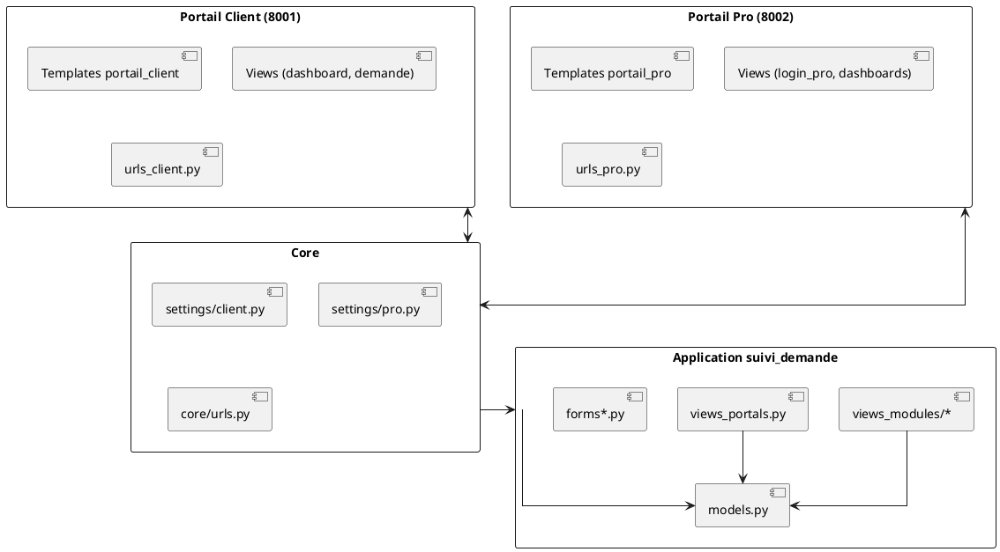
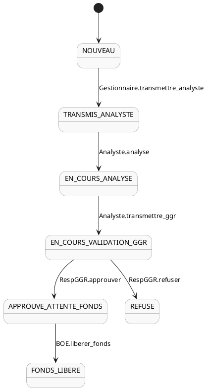
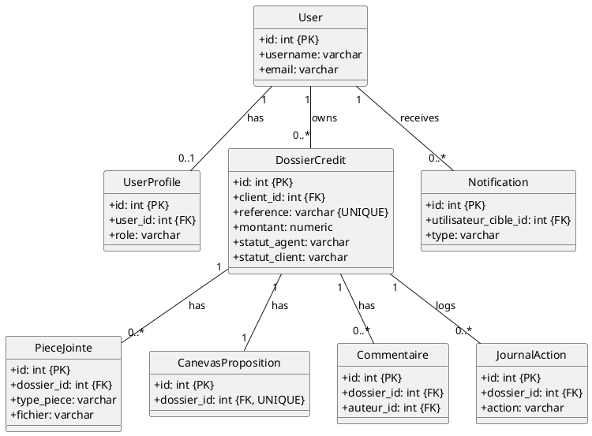

# GUIDE DE SOUTENANCE — GGR Credit Workflow

Version: 1.1.0
Date: 5 novembre 2025

---

## 1) Pitch du projet (30 secondes)
- GGR Credit Workflow est une application Django qui digitalise le processus de demande de crédit bancaire, du dépôt client jusqu’à la libération des fonds.
- Deux portails: Client (8001) et Professionnel (8002). Des rôles métiers pilotent un workflow strict et traçable.
- Objectifs: réduire les délais, tracer les actions, sécuriser les données, produire des rapports.

---

## 2) Architecture et technologies
- Backend: Python 3.10+, Django 5.2.6
- Base de données: PostgreSQL 14+
- Frontend: Templates Django + Bootstrap 5
- Fichiers statiques: WhiteNoise
- Génération PDF: xhtml2pdf
- Logs: logging Python + fichiers sous `logs/`

### Points clés d’architecture Django
- MVT (Model–View–Template) strict
- Séparation par portails via settings dédiés et namespaces d’URL
- Rôles/permissions au niveau métier dans les vues et middleware (si activé)

---

## 3) Arborescence et rôle de chaque dossier
```
ggr-credit-workflow/
├── core/                        # Configuration Django (settings et URLs root)
│   ├── settings/
│   │   ├── base.py             # Réglages communs (apps, DB, templates, statiques)
│   │   ├── client.py           # Spécifique Portail Client (PORTAL_TYPE, TEMPLATES, cookies)
│   │   └── pro.py              # Spécifique Portail Pro (ALLOWED_ROLES, TEMPLATES, cookies)
│   ├── urls.py                 # Montage des routeurs /accounts, /pro, /client, racine
│   └── wsgi.py                 # Point d'entrée WSGI
│
├── suivi_demande/              # Application principale (métier)
│   ├── models.py               # Modèles (DossierCredit, UserProfile, PieceJointe, ...)
│   ├── views.py                # Vues historiques (restées pour compatibilité)
│   ├── views_portals.py        # Vues spécifiques portails (login_client, login_pro, listes pro)
│   ├── views_modules/          # Vues modulaires (dashboard, workflow, notifications, ...)
│   ├── urls.py                 # Routes génériques
│   ├── urls_client.py          # Routes Portail Client (namespace client)
│   ├── urls_pro.py             # Routes Portail Pro (namespace pro)
│   ├── forms.py                # Formulaire d'inscription + champs rôle (pro uniquement)
│   ├── forms_demande*.py       # Formulaires du wizard de demande (étapes)
│   ├── middleware_portal.py    # (Optionnel) restriction par portail/rôle
│   ├── constants.py            # Constantes métier (montants, taux)
│   ├── logging_config.py       # Fonctions de log/audit
│   └── tests/                  # Tests unitaires et intégration
│
├── templates/                  # Templates globaux
│   ├── registration/login.html # Login pro par défaut (override Django auth)
│   ├── accounts/signup.html    # Page d'inscription
│   ├── portail_client/         # Templates dédiés client (login, pages)
│   │   └── registration/login.html  # Override login spécifique client
│   └── suivi_demande/          # Dashboards, rapports, pages dossier
│
├── static/                     # CSS, JS, images
├── media/                      # Fichiers uploadés (organisés par dossier)
├── logs/                       # Fichiers de logs (workflow, actions, erreurs)
└── docs/                       # Documentation du projet
```

Pourquoi ces dossiers:
- Séparer `core/settings/client.py` et `core/settings/pro.py` permet d’adapter templates, rôles et cookies par portail.
- `views_portals.py` isole la logique de connexion par portail et les vues "pro" transverses.
- `views_modules/` découpe les responsabilités (dashboard, workflow, notifications) pour maintenir le code.
- `templates/portail_client` et `templates/portail_pro` (via TEMPLATES[DIRS]) garantissent un branding/rendu distinct.

---

## 4) Portails, rôles et permissions

### Portail Client (8001)
- URL: http://127.0.0.1:8001
- Pour: Demandeurs de crédit
- Accès: login client dédié (`/client/login/`) ou `/accounts/login/` via override template
- Actions: créer et soumettre une demande via wizard, consulter et télécharger ses documents, lire l’historique et notifications
- Lecture seule après soumission; pas d’upload post-soumission sans retour du gestionnaire

### Portail Professionnel (8002)
- URL: http://127.0.0.1:8002/pro/
- Rôles: Gestionnaire, Analyste, Responsable GGR, BOE, Super Admin
- Connexion: `views_portals.login_pro_view`

### Rôles (UserRoles)
- CLIENT: accès à ses propres dossiers uniquement
- GESTIONNAIRE: traite les nouveaux dossiers, transmet à l’analyste, retour client
- ANALYSTE: analyse, transmet au GGR ou retour gestionnaire
- RESPONSABLE_GGR: approuve/refuse, peut demander compléments
- BOE: libère les fonds après approbation
- SUPER_ADMIN: gestion avancée des utilisateurs

### Permissions (exemples)
- Client: créer une demande, consulter ses dossiers, télécharger documents
- Gestionnaire: voir tous les dossiers, transmettre/retourner
- Analyste: voir tous les dossiers, transmettre GGR, retour gestionnaire
- Resp. GGR: approuver/refuser
- BOE: libérer fonds

---

## 5) Authentification, inscription et restrictions
- Login/Logout: Django auth (overrides de templates pour chaque portail)
- Inscription: `templates/accounts/signup.html` + `suivi_demande/forms.py::SignupForm`
  - Champ rôle visible côté pro uniquement; côté client, rôle = CLIENT automatique
  - CGU obligatoire, indicateur de force de mot de passe, affichage/masquage
- Validation admin: compte inactif jusqu’à activation par un admin (mention explicite sur les pages login)
- Middleware (optionnel): `PortalAccessMiddleware` pour contraindre les rôles par portail

---

## 6) Workflow métier (statuts et transitions)
Statuts côté agent (banque):
- NOUVEAU → TRANSMIS_ANALYSTE → EN_COURS_ANALYSE → EN_COURS_VALIDATION_GGR → (APPROUVE_ATTENTE_FONDS | REFUSE) → FONDS_LIBERE

Statuts côté client:
- EN_ATTENTE → EN_COURS_TRAITEMENT → SE_RAPPROCHER_GEST → TERMINE

Transitions clés (exemples):
- Gestionnaire: transmettre_analyste, retour_client
- Analyste: transmettre_ggr, retour_gestionnaire
- Responsable GGR: approuver, refuser
- BOE: liberer_fonds

Traçabilité:
- `JournalAction` enregistre l’acteur, l’action, l’avant/après et un `meta` JSON
- Notifications internes pour chaque étape importante

---

## 7) Modèles de données (tables et relations)
- User (Django): `auth_user`
- UserProfile: `suivi_demande_userprofile` (O2O User, champ `role`)
- DossierCredit: `suivi_demande_dossiercredit` (FK client, montants, statuts, timestamps)
- PieceJointe: `suivi_demande_piecejointe` (FK dossier, type, fichier, taille)
- CanevasProposition: `suivi_demande_canevasproposition` (O2O dossier, calculs de capacité, documents)
- Commentaire: `suivi_demande_commentaire` (FK dossier, auteur, cible_role)
- JournalAction: `suivi_demande_journalaction` (FK dossier, action, meta JSON)
- Notification: `suivi_demande_notification` (FK utilisateur cible, type, canal)

Clés et index importants:
- `DossierCredit.reference` unique + index
- Index combinés `client/statut_agent` et `statut_agent/is_archived`

---

## 8) Gestion des documents
- Upload initial des pièces en Étape 4 (PDF/JPG/PNG) avec taille max (ex.: 5 MB)
- Stockage sous `media/dossiers/<REFERENCE>/...`
- Après soumission: pas d’upload par le client; compléments via retour du gestionnaire
- Indicateurs (doc_cni_ok, etc.) mis à jour automatiquement via `CanevasProposition.update_doc_flags_from_pieces()`

---

## 9) Sécurité, logs et audit
- Sécurité Django standard (CSRF, sessions), cookies de session séparés par portail
- Rôles et permissions contrôlés dans les vues, éventuellement middleware
- Logs:
  - Actions workflow et transitions
  - Journal par dossier (`JournalAction`)
  - Fichiers sous `logs/` (créés au lancement)

---

## 10) Déploiement et exécution locale
- Ports: 8001 (client), 8002 (pro)
- Settings par portail: `core/settings/client.py` et `core/settings/pro.py`
- URL root: `core/urls.py` monte `/accounts/`, `/pro/`, `/client/` et la racine de l’app
- Fichiers statiques: gérés par WhiteNoise en production
- Génération PDF: via vues PDF (xhtml2pdf)

---

## 11) Scénario de démonstration (jury)
1. Portail Client (http://127.0.0.1:8001)
   - Inscription (rappeler la validation admin)
   - Connexion client, lancement du wizard (4 étapes)
   - Étape 4: pièces et consentements
   - Soumission → tableau de bord client (dossiers, historique, notifications)
2. Passage Portail Pro (http://127.0.0.1:8002/pro/)
   - Connexion Gestionnaire → transmet à l’analyste ou retour client
   - Connexion Analyste → transmet au GGR
   - Connexion Responsable GGR → approuve/refuse
   - Connexion BOE → libère les fonds
3. Revenir côté client: voir le statut mis à jour et l’historique

Astuce: préparer des comptes de démo pour chaque rôle.

### Comptes de démo (à adapter)
- Client: `client.demo` / `••••••••` → http://127.0.0.1:8001
- Gestionnaire: `gest.demo` / `••••••••` → http://127.0.0.1:8002/pro/
- Analyste: `analyste.demo` / `••••••••` → http://127.0.0.1:8002/pro/
- Responsable GGR: `ggr.demo` / `••••••••` → http://127.0.0.1:8002/pro/
- BOE: `boe.demo` / `••••••••` → http://127.0.0.1:8002/pro/
- Super Admin: `admin.demo` / `••••••••` → http://127.0.0.1:8002/pro/

Note: remplacez les identifiants par vos comptes réels avant la soutenance.

---

## 12) FAQ — Questions fréquentes du jury
- Pourquoi deux portails séparés ?
  - Sécurité, UX ciblée et configuration templates/roles spécifiques.
- Comment garantissez-vous la traçabilité ?
  - `JournalAction` + logs fichiers + notifications.
- Que se passe-t-il si un client tente d’accéder au portail pro ?
  - Message d’erreur et refus d’accès dans `login_pro_view` (vérification du rôle).
- Peut-on changer le rôle d’un utilisateur ?
  - Oui côté Super Admin/gestion, vues admin prévues.
- Comment sont gérés les documents ?
  - Upload initial seulement; après soumission, lecture/téléchargement; compléments via gestionnaire.

---

## 13) Glossaire (sigles)
- GGR: Service interne (Responsable GGR)
- BOE: Back Office Engagement
- DG: Directeur Général
- CGU: Conditions Générales d’Utilisation
- FCFA: Franc CFA
- PDF/XLSX: Formats de documents (génération/export)
- MVT: Model–View–Template (architecture Django)

---

## 14) Points différenciants et bonnes pratiques
- Découpage clair des portails et des vues modulaires → maintenance facilitée
- Traçabilité complète des transitions + notifications multi-acteurs
- Conventions Django par défaut pour les tables → simplicité et cohérence
- Séparation des settings pour isoler comportements client/pro

---

## 15) Références rapides (fichiers clés)
- Portails: `suivi_demande/urls_client.py`, `suivi_demande/urls_pro.py`, `core/urls.py`
- Connexions: `suivi_demande/views_portals.py` (login_client_view, login_pro_view)
- Modèles: `suivi_demande/models.py`
- Dashboards: `suivi_demande/views_modules/dashboard.py` + templates
- Workflow: `suivi_demande/views_modules/workflow.py`
- Inscription: `templates/accounts/signup.html`, `suivi_demande/forms.py`
- Templates login: `templates/registration/login.html` (pro), `templates/portail_client/registration/login.html` (client)

---

## 16) Conseils de présentation
- Toujours rattacher une fonctionnalité à un rôle précis et au statut du dossier
- Utiliser le scénario de démonstration pour raconter le "parcours de la donnée"
- Avoir une définition claire des sigles et des statuts à portée de main

---

## 17) Schémas (Mermaid)

### 17.1 Architecture (MVT et portails)


### 17.2 Workflow des statuts (banque)


### 17.3 Modèle de données (ERD simplifié)


---

## 18) Export PDF

### Option A — Pandoc (recommandé)
1. Installer Pandoc: https://pandoc.org/installing.html
2. Commandes (à exécuter dans le dossier du projet):
   - `pandoc -s -o docs/GUIDE_SOUTENANCE_JURY.pdf docs/GUIDE_SOUTENANCE_JURY.md`
   - `pandoc -s -o docs/DOCUMENTATION_COMPLETE_PROJET.pdf docs/DOCUMENTATION_COMPLETE_PROJET.md`
3. (Optionnel) Thème: ajouter `--from gfm --pdf-engine=xelatex` pour un rendu avancé.

### Option B — Extensions éditeur
- Utiliser une extension Markdown PDF (VS Code) pour exporter directement depuis l’éditeur.

Note: Les blocs Mermaid peuvent nécessiter un pré-rendu (extensions Mermaid) si le convertisseur ne les gère pas nativement.
