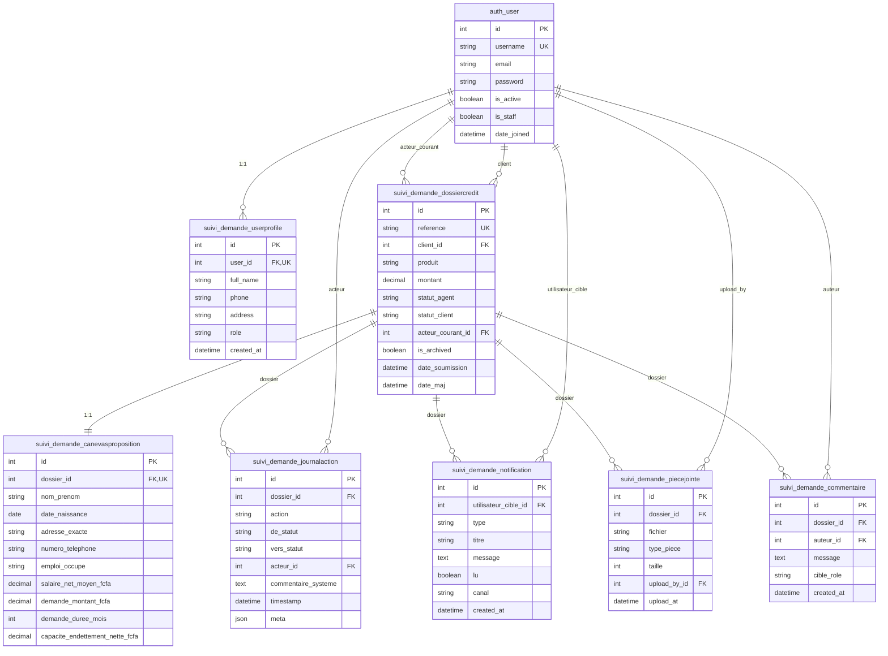

# 🗄️ DIAGRAMME ERD - BASE DE DONNÉES

## Diagramme Entité-Relation (ERD)



## Légende

- **PK**: Primary Key (Clé primaire)
- **FK**: Foreign Key (Clé étrangère)
- **UK**: Unique Key (Contrainte d'unicité)
- **||--||**: Relation 1:1
- **||--o{**: Relation 1:N

## Contraintes d'Intégrité

### Contraintes CHECK
```sql
ALTER TABLE suivi_demande_dossiercredit 
ADD CONSTRAINT montant_positif CHECK (montant > 0);

ALTER TABLE suivi_demande_canevasproposition 
ADD CONSTRAINT salaire_positif CHECK (salaire_net_moyen_fcfa > 0);

ALTER TABLE suivi_demande_canevasproposition 
ADD CONSTRAINT duree_positive CHECK (demande_duree_mois > 0);
```

### Index pour Performances
```sql
CREATE INDEX idx_dossier_statut_agent ON suivi_demande_dossiercredit(statut_agent);
CREATE INDEX idx_dossier_client ON suivi_demande_dossiercredit(client_id);
CREATE INDEX idx_dossier_date ON suivi_demande_dossiercredit(date_soumission);
CREATE INDEX idx_journal_dossier ON suivi_demande_journalaction(dossier_id);
CREATE INDEX idx_journal_timestamp ON suivi_demande_journalaction(timestamp);
```

## Normalisation

### Forme Normale 3 (3NF)

Le schéma respecte la 3NF:
- **1NF**: Toutes les colonnes contiennent des valeurs atomiques
- **2NF**: Pas de dépendances partielles (toutes les clés sont simples)
- **3NF**: Pas de dépendances transitives

**Exemple**: 
- `capacite_endettement_nette_fcfa` dépend de `salaire_net_moyen_fcfa` et `total_echeances_credits_cours`
- Ces champs sont dans la même table `canevasproposition` (pas de dépendance transitive)
