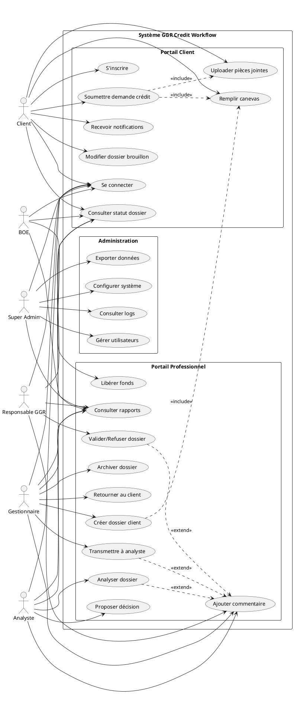

# 📊 DIAGRAMME UML - CAS D'UTILISATION

## Diagramme de Cas d'Utilisation

## Description des Cas d'Utilisation

### Portail Client

| ID | Cas d'Utilisation | Acteur | Description |
|----|-------------------|--------|-------------|
| UC1 | S'inscrire | Client | Créer un compte avec email, téléphone, adresse |
| UC2 | Se connecter | Tous | Authentification username/password |
| UC3 | Soumettre demande crédit | Client | Créer une nouvelle demande de crédit |
| UC4 | Remplir canevas | Client, Gestionnaire | Compléter le formulaire de proposition (4 étapes) |
| UC5 | Uploader pièces jointes | Client | Télécharger CNI, fiches de paie, etc. |
| UC6 | Consulter statut dossier | Tous | Voir l'état d'avancement du dossier |
| UC7 | Recevoir notifications | Client | Notifications email/internes sur changements |
| UC8 | Modifier dossier brouillon | Client | Modifier avant soumission finale |

### Portail Professionnel

| ID | Cas d'Utilisation | Acteur | Description |
|----|-------------------|--------|-------------|
| UC9 | Créer dossier client | Gestionnaire | Créer un dossier pour un client (guichet) |
| UC10 | Transmettre à analyste | Gestionnaire | Envoyer le dossier à l'analyste crédit |
| UC11 | Analyser dossier | Analyste | Étudier la solvabilité, risques |
| UC12 | Proposer décision | Analyste | Recommander approbation/refus |
| UC13 | Valider/Refuser dossier | Responsable GGR | Décision finale sur le crédit |
| UC14 | Libérer fonds | BOE | Débloquer les fonds approuvés |
| UC15 | Consulter rapports | Tous pros | Voir KPI, statistiques, graphiques |
| UC16 | Archiver dossier | Gestionnaire | Archiver dossiers terminés |
| UC17 | Ajouter commentaire | Tous pros | Commenter un dossier |
| UC18 | Retourner au client | Gestionnaire, Analyste | Demander complément d'information |

### Administration

| ID | Cas d'Utilisation | Acteur | Description |
|----|-------------------|--------|-------------|
| UC19 | Gérer utilisateurs | Super Admin | CRUD utilisateurs, rôles |
| UC20 | Configurer système | Super Admin | Paramètres, constantes métier |
| UC21 | Consulter logs | Super Admin | Audit trail, sécurité |
| UC22 | Exporter données | Super Admin | Export CSV, Excel, rapports |

## Relations

- **<<include>>**: Relation obligatoire (UC3 inclut toujours UC4 et UC5)
- **<<extend>>**: Relation optionnelle (UC10 peut étendre UC17 si commentaire ajouté)

## Préconditions et Postconditions

### UC3: Soumettre demande crédit

**Préconditions:**
- Client authentifié
- Profil client complet

**Postconditions:**
- Dossier créé avec statut NOUVEAU
- Entrée JournalAction créée
- Notification envoyée au gestionnaire

### UC13: Valider/Refuser dossier

**Préconditions:**
- Dossier au statut EN_COURS_VALIDATION_GGR
- Analyste a proposé une décision
- Responsable GGR authentifié

**Postconditions:**
- Statut changé vers APPROUVE_ATTENTE_FONDS ou REFUSE
- Entrée JournalAction créée
- Notification envoyée au client
- Si approuvé: dossier transmis au BOE
