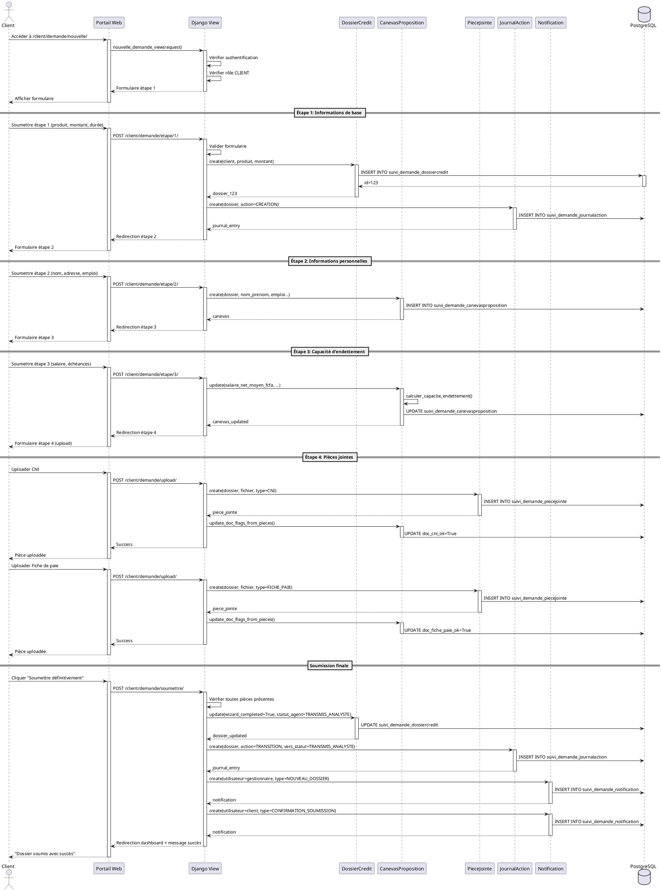

# 🔄 DIAGRAMME UML - SÉQUENCE

## Diagramme de Séquence: Soumission Dossier de Crédit

## Description du Flux

### Phase 1: Initialisation (Étape 1)
1. Client accède au formulaire de nouvelle demande
2. Django vérifie l'authentification et le rôle
3. Client remplit produit, montant, durée
4. Django crée le `DossierCredit` avec statut NOUVEAU
5. Entrée `JournalAction` créée (action=CREATION)

### Phase 2: Informations Personnelles (Étape 2)
1. Client remplit nom, adresse, emploi, situation familiale
2. Django crée le `CanevasProposition` lié au dossier

### Phase 3: Capacité d'Endettement (Étape 3)
1. Client saisit salaire, échéances en cours
2. Django calcule automatiquement:
   - Capacité brute = 40% du salaire
   - Capacité nette = Capacité brute - échéances
3. Mise à jour du `CanevasProposition`

### Phase 4: Pièces Jointes (Étape 4)
1. Client uploade CNI, fiches de paie, etc.
2. Django crée des `PieceJointe` pour chaque fichier
3. Mise à jour automatique des flags documents (doc_cni_ok, etc.)

### Phase 5: Soumission Finale
1. Client valide la soumission
2. Django vérifie que toutes les pièces obligatoires sont présentes
3. Mise à jour du dossier:
   - `wizard_completed = True`
   - `statut_agent = TRANSMIS_ANALYSTE`
4. Création d'une entrée `JournalAction` (TRANSITION)
5. Notifications envoyées:
   - Au gestionnaire (nouveau dossier à traiter)
   - Au client (confirmation de soumission)

## Temps de Réponse Estimés

| Étape | Temps moyen | Requêtes DB |
|-------|-------------|-------------|
| Étape 1 | 200ms | 2 (INSERT dossier + journal) |
| Étape 2 | 150ms | 1 (INSERT canevas) |
| Étape 3 | 180ms | 1 (UPDATE canevas) |
| Étape 4 (par pièce) | 300ms | 2 (INSERT piece + UPDATE canevas) |
| Soumission finale | 250ms | 4 (UPDATE dossier + INSERT journal + 2 notifications) |

**Total pour un dossier complet**: ~1.5-2 secondes (4 pièces jointes)
